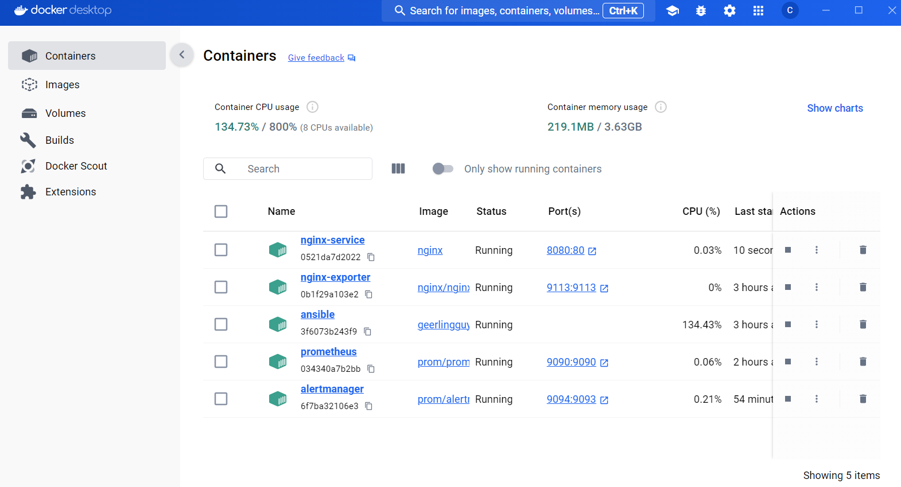
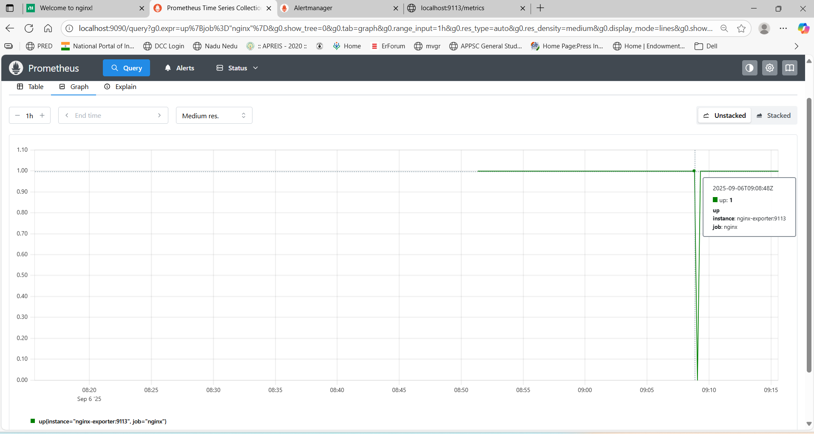
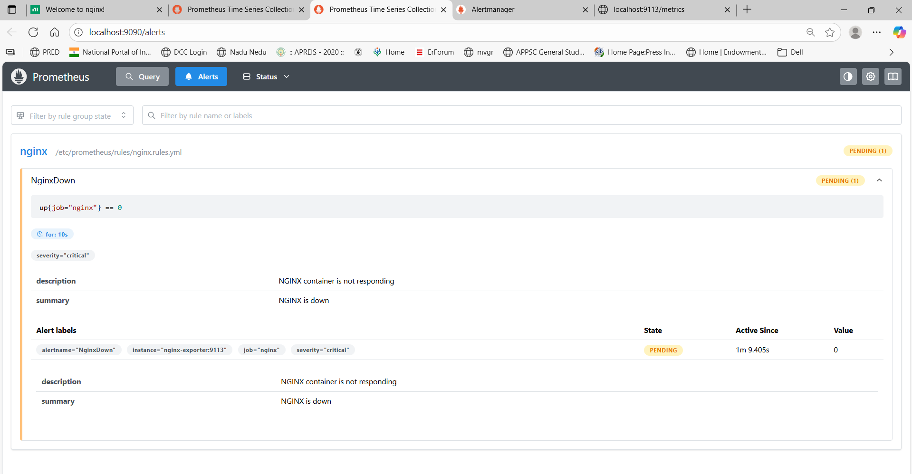

# Self-Healing Infrastructure with Prometheus, Alertmanager & Ansible

## Introduction
This project demonstrates an automated self-healing infrastructure using **Prometheus**, **Alertmanager**, and **Ansible**. It monitors a sample NGINX service and automatically recovers it if it goes down.

---

## Abstract
The infrastructure continuously monitors the NGINX container. When Prometheus detects that the service is down, Alertmanager triggers a webhook, which calls an Ansible playbook to restart the container automatically. The system provides real-time monitoring and automated recovery.

---

## Tools Used
- **Prometheus**: Metrics collection and alerting rules  
- **Alertmanager**: Alert management and webhook integration  
- **Ansible**: Automating container restart tasks  
- **Docker**: Containerized services  
- **Flask (Python)**: Webhook server  
- **NGINX**: Sample service for monitoring  

---

## Infrastructure Diagram

---

## Steps Involved in Building the Project

### 1. Deploy NGINX Service
NGINX container running as the monitored service:

Docker containers and images:

  

NGINX configuration:

---

### 2. Configure Prometheus
Prometheus config and rules for monitoring NGINX:

Prometheus main config:

NGINX alert rules:

Prometheus metrics graph:

Rule health status:

---

### 3. Configure Alertmanager
Alertmanager setup with webhook integration:

Alertmanager config file:

Alertmanager running:

Webhook configuration:

---

### 4. Ansible Playbook
Ansible playbook to restart NGINX container:

  

NGINX container restarted:

---

### 5. Triggering Alerts
When NGINX goes down, Prometheus fires an alert:

NGINX down alert firing:

  

NGINX pending or inactive alerts:

  

NGINX recovered and back online:

---
